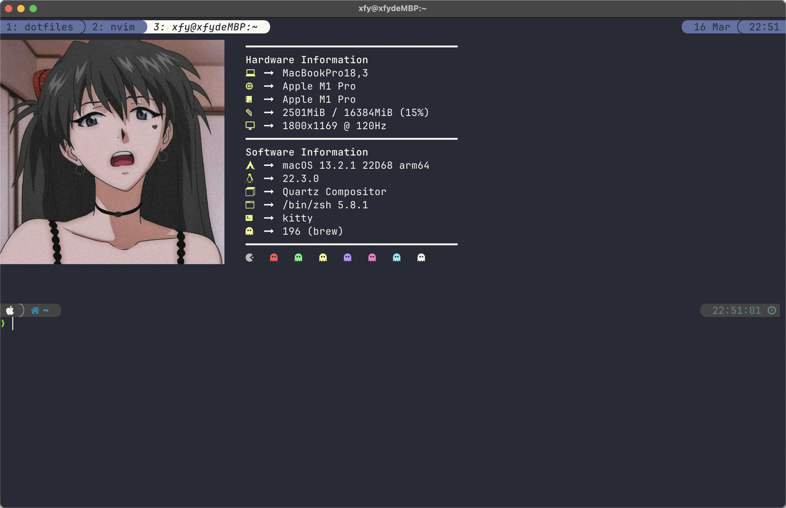
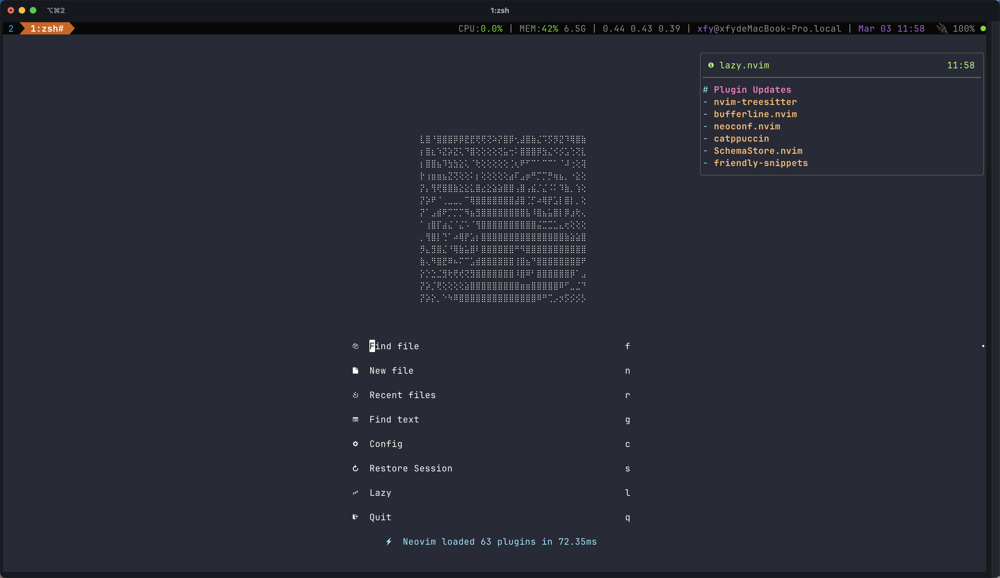
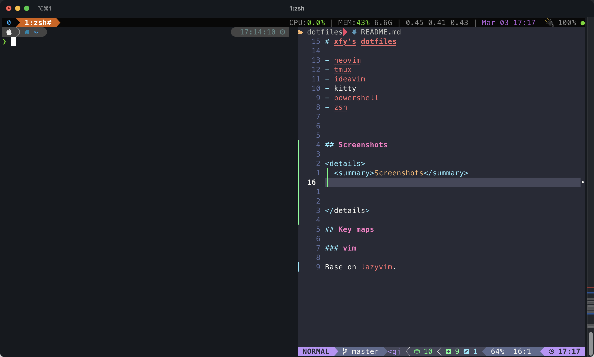
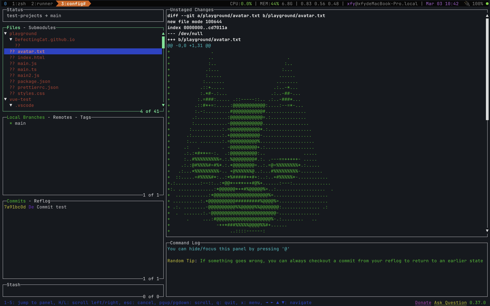

# xfy's dotfiles

- neovim
- tmux
- ideavim
- kitty
- powershell
- zsh

## Screenshots

  
Screenshots

## Key maps

### vim

Base on lazyvim.

### tmux

| Key   | Description |     |
| ----- | ----------- | --- |
| `C-b` | Prefix      |     |
| `c`   | New window  |     |
| `h`   | Next Panel  |     |
| `l`   | Prev Panel  |     |
